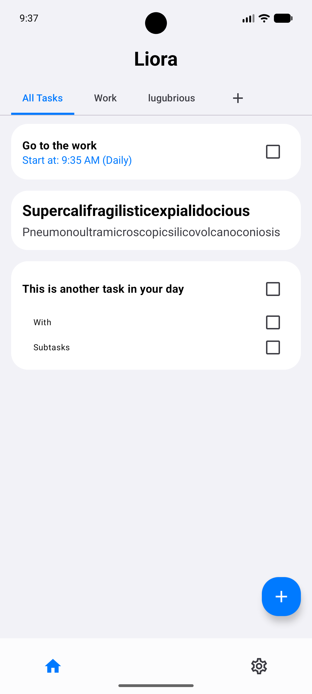
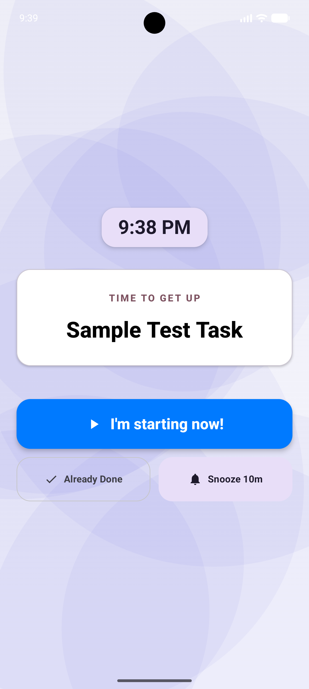
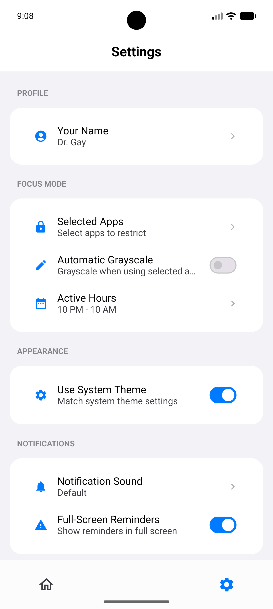

<p align="center">
  
</p>

# Liora App
Liora is a task management application specifically designed for me by me  : )

## Features
- **Quick Capture** - Instantly add notes or tasks via a quick action or the “+” button
- **Notes** - Save thoughts that aren’t tasks but shouldn’t be forgotten
- **Task Breakdown** - Split complex tasks into smaller actionable steps
- **Daily Momentum** - Recurring tasks automatically reset each day
- **Focus Protection** - Full-screen reminders and blocker mode to reduce distraction
- **Cognitive Load System** - Tasks are organized by effort level to reduce overwhelm
- **Privacy First** - All data is stored locally using Room database


## Screenshots

<p align="center">
  
  
  
</p>


## Installation

1. Download the latest APK from the [Releases page](https://github.com/Xephyrka/Liora/releases)
2. Install it on your phone
3. Enable WRITE_SECURE_SETTINGS permission by ADB to the app. THIS PERMISSION IS USED TO GRAYSCALE THE DISTRACTING APPS AND THAT ONLY
```bash
adb shell pm grant com.xephyrka.liora android.permission.WRITE_SECURE_SETTINGS
```

### Prerequisites
- Android SDK 29+


## Built With
- **Kotlin** - 100%
- **Jetpack Compose** - Modern declarative UI with animations
- **Room Database** - Persistent local storage with automated migrations
- **DataStore** - User preferences and theme settings
- **Navigation Compose** - Type-safe routing between screens


## Feedback

If you have any feedback, please reach out to me [here](https://github.com/Xephyrka/Liora/issues)


## License

MIT - see the [LICENSE](LICENSE) file for details
